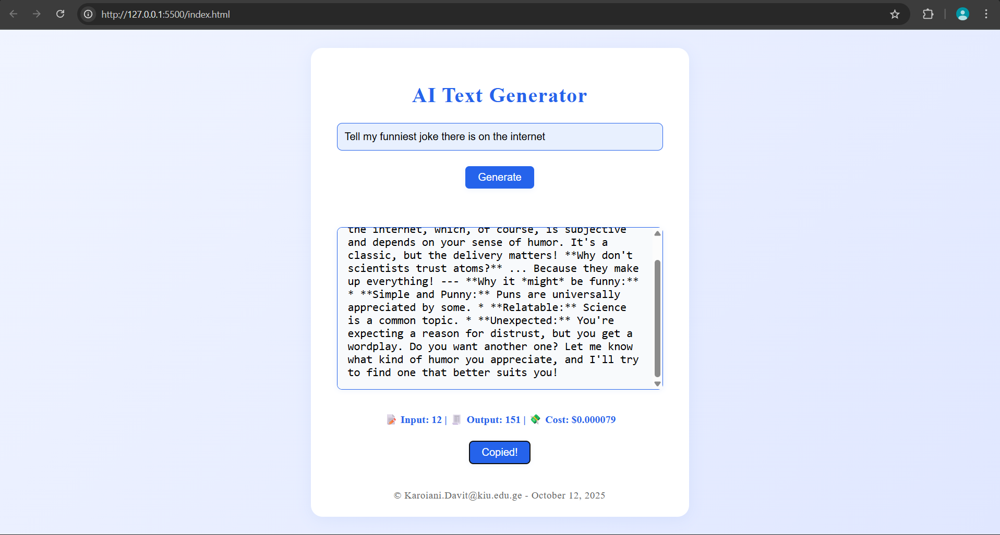

# AI Text Generator - Homework 1
## Author
[Karoiani Davit] - [Karoiani.Davit@kiu.edu.ge]
## Final Product Screenshot

🌟 Features Implemented
1. Real-Time Text Generation
Description:
I modified the app to use the streamGenerateContent() function, which displays the AI’s response word-by-word instead of all at once. This creates a smooth streaming effect that feels more interactive and natural for the user.

3. Token Usage & Cost Calculation
Description:
Once the full response is received, my code estimates the number of input and output tokens and calculates the approximate cost using predefined token rates. The results are displayed below the output area, showing input tokens, output tokens, and total cost in dollars.

3. Copy Response Button
Description:
I implemented a “Copy” button that uses the navigator.clipboard.writeText() API to copy the generated text directly from the output area. When clicked, the button briefly changes color and text to “Copied!” to confirm the action before reverting back.

4. Dynamic Footer with Email & Date
Description:
The footer of the page is automatically filled in when the site loads. A small script retrieves the current date using JavaScript’s new Date() and combines it with my email address (Karoiani.Davit@kiu.edu.ge) to create a personalized copyright line.

🚀 How to Run the Project

Clone this repository to your local machine.
Open the script.js file and replace the API_KEY value with your own Gemini API key from Google AI Studio
Start a local server (for example, run python -m http.server in your project folder).
Open your browser and go to http://localhost:8000
Enter a prompt and click Generate to see the AI respond in real-time!
